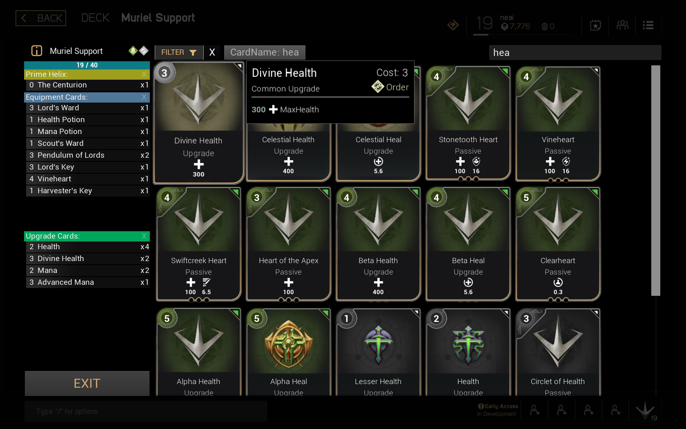

# Paragon UI Prototyping

## About
This repository contains a recreation of Paragon's UI using UMG & UE 4.11. Currently it contains the Deck Builder UI, recreated very closely to the original.

It's main purpose is to enable quick prototyping of UI ideas by any UE developers in the Paragon community. Data & Art is imported from the Paragon Community kit where possible.

A custom Deck Builder app is planned to be deployed for desktop, mobile & HTML5.

## Deck Builder

Current implementation tries to follow the design of Paragon's deck builder very closely.

### TODO
* Filtering by possible card upgrades.
* Refactor C++ card filtering
* Virtual card list, instead of a scrollbox with a lot of cards. This will improve performance a lot.
* Experiment with MVVM & Presenter patterns, verify that this will not create reference cycles in blueprints.
* Serialisation of deck card list.
* Limiting number of cards.
* Alert popups.
* Deck Stats.
* Alternative Deck Builder prototypes.

### Screenshots

